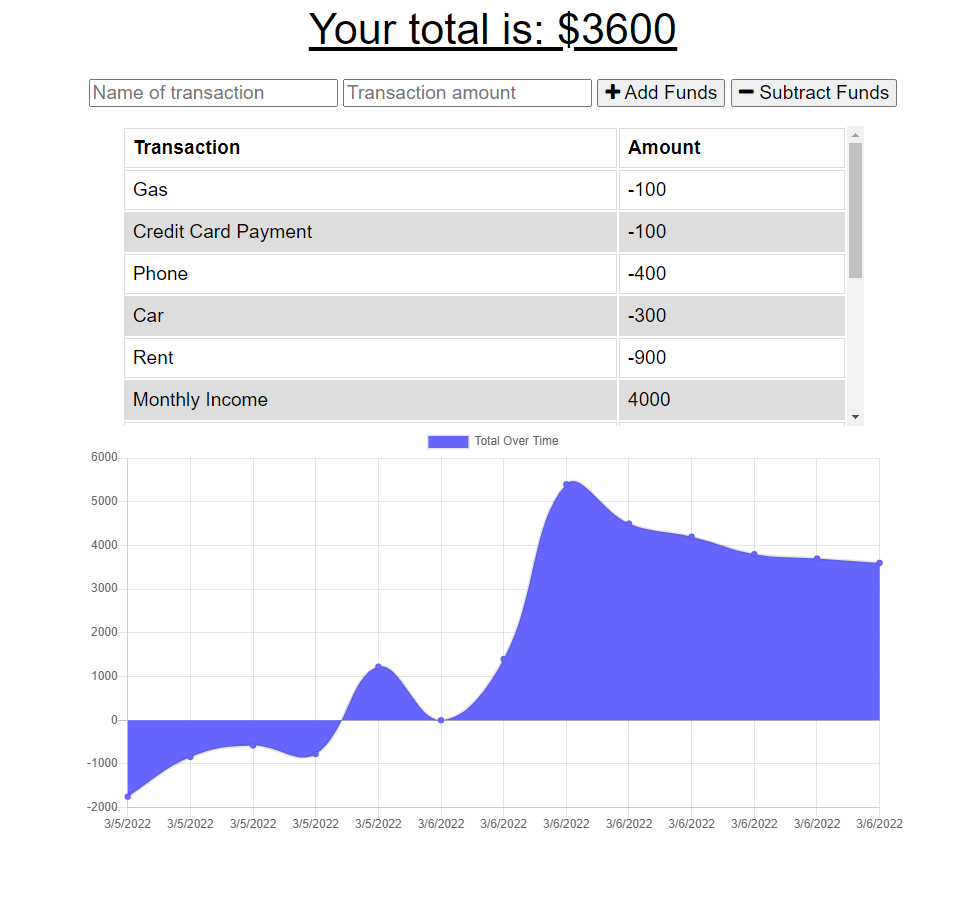

  # PWAlletTracker --- (PWA wallet-tracker || P WAllet Tracker)
  
  
  
  
  ## USER STORY
  ```
  AS AN avid traveler
  I WANT to be able to track my withdrawals and deposits with or without a data/internet connection
  SO THAT my account balance is accurate when I am traveling 
  ```
  ## ACCEPTANCE CRITERIA
  
  ```
  GIVEN a budget tracker without an internet connection
  WHEN the user inputs an expense or deposit
  THEN they will receive a notification that they have added an expense or deposit
  WHEN the user reestablishes an internet connection
  THEN the deposits or expenses added while they were offline are added to their transaction history and their totals are updated
  ```
  
  </br>
    

  https://user-images.githubusercontent.com/87203701/156954272-ba78fd59-e94d-4f6a-9e87-ed00523d2048.mp4


  ## Table-of-Contents

  * [Description](#description)
  * [Installation](#installation)
  * [Usage](#usage)
  
  * [License](#license)
    
  * [Contributing](#contributing)
  * [Questions](#questions)
  
  ## [Description](#table-of-contents)
  
  

  This application will allow you to keep track of your WITHDRAWALS and DEPOSITS with or without a data/internet connection

  ## [Installation](#table-of-contents)

  Clone this [repository](https://github.com/cboensch6505/PWAlletTracker) insuring that all dependencies are met use `npm start` to initiate the application and navigate to `localhost:3001` to use the PWAlletTracker.

  ## [Usage](#table-of-contents)

  Name your transaction and give it a dollar ammount. Then select either `Add Funds` or `Subtract Funds` depending on if it was a withdrawal or deposit. This will then update  your chart below as well as give you your new balance.
  
  
  ## [License](#table-of-contents)

  The application is covered under the following license:

  
  [mit](https://choosealicense.com/licenses/mit)
    
    
  ## [Contributing](#table-of-contents)
  
  
  Thank you for your interest in helping out; however, I will not be accepting contributions from third parties.
    

  ## [Questions](#table-of-contents)

  Please contact me using the following links:

  [GitHub](https://github.com/cboensch6505)

  [Email: cboensch6505@gmail.com](mailto:cboensch6505@gmail.com)
